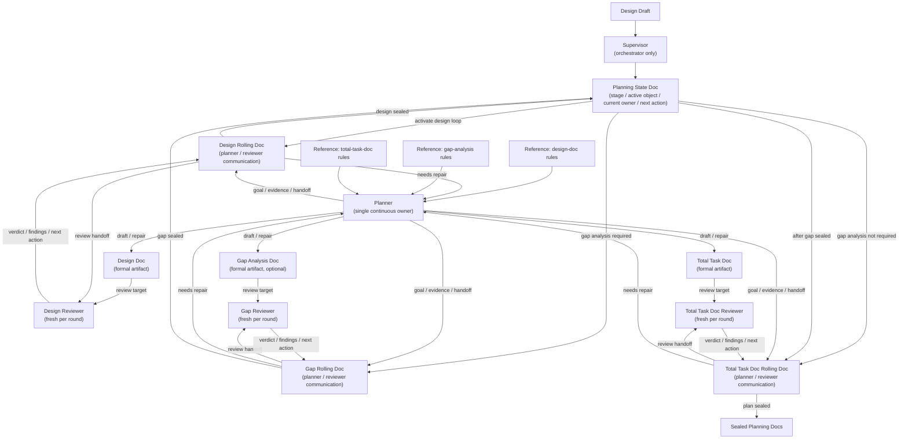
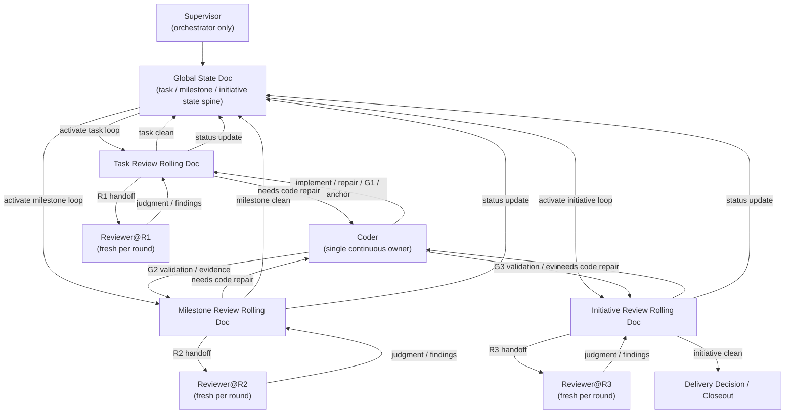

# Codex 原生 Initiative 自动编码套件总体机制与落地方案

## 封面信息卡

| 项目 | 内容 |
| --- | --- |
| 文档名称 | Codex 原生 Initiative 自动编码套件总体机制与落地方案 |
| 文档层级 | Codex 落地方案层 |
| 文档定位 | 上位宪法与 Codex 原生机制之间的总体映射与运行说明文档 |
| 适用范围 | 需要以 Initiative 为主入口、以 Milestone 为阶段收敛边界、以 Task 为内部原子的 Agent 自动编码体系 |
| 非目标 | 不定义上位宪法；不展开数据模型、状态机、artifact 合同细节；不展开逐 PR 实施计划 |

## 0. 文档定位

本文档只回答一个问题：

> 如何把上位宪法层的对象模型、角色边界、Gate / Review 体系，映射为一套符合 Codex 原生机制的 Initiative 自动编码套件，并说明其总体运行方式。

本文档是**总体机制文档**，不是技术定义文档，也不是实施排期文档。
它的职责是把下列问题一次性说清：

- 用户入口究竟是什么
- Supervisor 主 Agent 在 Codex 中承担什么正式责任
- Task、Milestone、Initiative 分别如何在 Codex 原生机制中落位
- 为什么某些外部方法只能被局部吸收，而不能上升为总框架
- 用户如何使用这套系统
- 系统内部如何从一个 Initiative 持续推进到阶段收口与交付收口

本文档不承担以下职责：

- 不重定义 Initiative / Milestone / Task 的法位
- 不给出完整数据模型、状态机与 artifact 合同定义
- 不给出函数级算法与实现接口细节
- 不给出逐 PR 的专项实施排期
- 不替代技术设计说明书与专项实施作战计划书

因此，本文档与后续两篇文档的关系固定如下：

- 本文档负责**机制、映射、流程、约束**
- 技术设计说明书负责**模型、状态、工件、接口、算法**
- 专项实施作战计划书负责**阶段、PR、验收、推进**

---

## 1. 上位法继承与下位裁决边界

### 1.1 继承的上位文档

本方案直接继承以下六篇上位宪法文档，不在下位重新定义其法位：

- `Agent 编程项目核心术语表`
- `Agent 编程项目执行模型法典`
- `Agent 编程项目规划模型`
- `Agent 编程项目 Planner 协议`
- `Agent 编程项目 Coder 协议`
- `Agent 编程项目 Reviewer 协议`

因此，本方案并不重新回答以下问题：

- Initiative / Milestone / Task 是什么
- G1 / G2 / G3 与 R1 / R2 / R3 的法位是什么
- Planner / Coder / Reviewer 的边界是什么
- 总任务文档为什么是合法执行总图

这些都已由上位文档封板。

### 1.2 本文档新增的下位裁决

在不改写上位宪法的前提下，本文档补充下列 **Codex 落地级裁决**：

第一，**Codex 原生运行主形态应明确写成 Supervisor + bounded subagents。**  
Supervisor 主 Agent 负责 Initiative 绑定、Milestone frontier、Ready Task 选择、升级汇总、正式收口与用户断点；subagents 只负责 bounded work，不拥有对象层裁决权。

第二，**Initiative 是用户与正式调度的唯一默认主入口。**  
用户启动的是一个 Initiative，而不是一个 Task。Task 只在系统内部作为最小执行原子被调度。

第三，**Milestone 是正式阶段收敛与用户断点的默认边界。**  
Milestone 不只是规划层对象，还决定了系统何时开 PR、何时进入 G2 / R2、何时向用户请求阶段裁决。

第四，**Agent 间主通信协议应优先采用 `Global State Doc + 对象级滚动通信文档`，而不是把代码接口调用当成一级协议。**  
最符合 Codex 原生协作形态的通信方式，是由一份 `Global State Doc` 维护全局状态脊柱，再围绕当前活跃的 Initiative / Milestone / Task 维护单份主滚动文档；brief、note、report 只作为其裁剪片段或派生视图；脚本只负责解析、索引、校验与渲染这些工件。

第五，**Task 执行子循环可以采用局部委派执行模板，但它不构成整个系统的上位框架。**  
也就是说，Task 内可以存在 coder 的多轮实现、自测与修补；但正式主链只认 `coder 完成 -> G1 -> anchor commit -> R1`，系统整体仍然是 Initiative-first，而不是 task-first delegate framework。

第六，**Task 内部编码过程不新增 formal Gate / Review 层。**  
coder 在 Task 内部为达到可锚定状态所做的自测、自校与修补，都只是实现过程；先通过 G1，再沉淀 anchor commit，随后才进入 R1。

第七，**Supervisor 主 Agent 不是空壳 dispatch agent。**  
它必须保留 Initiative 调度、Milestone frontier、Ready Task 选择、升级裁决汇总、用户断点沟通与正式收口衔接职责。

第八，**Codex 原生机制各自承担固定法位。**  
`AGENTS.md` 承担治理层，skills 承担 workflow plane，custom agents 承担 subagent 角色面，repo 内脚本与 Python 内核承担确定性解析、校验与渲染面。

第九，**运行态必须可重建。**  
任何运行时 cache 都只能是派生状态，不得成为正式真理源。

### 1.3 不进入本文档的内容

以下内容不属于本篇职责，应下沉到第二篇技术设计说明书：

- `initiative_plan`、`initiative_state`、`task_brief / task_packet_view` 等具体模型
- 状态枚举、跃迁规则、loop phase 细节
- rolling dossier / brief / report / runtime facts 的字段合同
- scripts 如何解析、校验、索引这些文档工件
- 持久化路径、命名规则、工件索引策略
- 错误模型、mock、测试设计

以下内容不属于本篇职责，应下沉到第三篇专项实施作战计划书：

- 当前专项的阶段拆分
- PR 序列与依赖关系
- 每个 PR 的写入范围
- 验收清单与回退点

---

## 2. Codex 原生机制与体系映射前提

### 2.1 Codex 原生机制总览

Codex 当前原生能力更接近一套 **Supervisor 主 Agent + 显式 subagents** 的原生协作架构，而不是单一 prompt 入口，也不是纯代码接口调用图。
在本方案中，真正会被拿来承载体系的机制主要有六类：

- `AGENTS.md`
- `skills`
- `custom agents / subagents`
- App
- CLI
- GitHub / Automations / Worktrees 等配套机制

这些机制并不是平级替代关系，而是共同服务于一条固定主链：

> **Supervisor 主 Agent 负责调度。**
> **subagents 负责 bounded work。**
> **`Global State Doc` 与对象级滚动通信文档负责跨 Agent 通信。**

在此基础上，它们各自承担不同法位：

- `AGENTS.md` 负责提供持久、分层、就近覆盖的项目规则；Codex 会在工作前读取相关指令文件，并按 root-to-leaf 的顺序拼接，越接近当前目录的规则优先级越高。[1]
- skills 负责承载可复用 workflow；它们采用 progressive disclosure，只在真正命中时才加载完整 `SKILL.md`，并可携带 `scripts/`、`references/`、`assets/` 与 `agents/openai.yaml`。[2]
- subagents 负责显式委派的局部工作；Codex 只会在你明确要求时才创建 subagent，而且每个 subagent 都会带来额外 token 与工具成本。[3]
- App 原生提供并行任务、内置 Git、worktrees、review pane、automations 等控制台能力，适合作为日常主操作面。[4][5][6]
- GitHub 适合作为 PR 级代码评审面，可用 `@codex review` 或 Automatic reviews 获取辅助审查输入。[7]
- `.codex/config.toml` 用于共享配置默认值，而不是运行态存储；Codex 会叠加用户级和项目级配置，最近目录的项目配置优先。[8]

因此，本方案不是在 Codex 之上另造一套平行控制系统，而是：

> **利用 Codex 已有的原生分层机制，承载上位宪法要求的对象、流程与边界。**

### 2.2 为什么必须做机制映射，而不是直接照搬外部方法

外部方法可以提供局部启发，但它们不能直接成为我们的总框架。

原因在于，上位宪法已经把系统法位固定为：

- Initiative 是最高层执行对象
- Milestone 是正式阶段收敛边界
- Task 是内部最小工程闭环
- Gate / Review 采用三层正式结构

而很多外部方法只解决其中一段问题。
例如：

- 有些方法长于 Task 内的委派执行与多轮修补
- 有些方法长于把大任务压成 Initiative-first 的总图
- 有些方法更偏工具编排，不足以承担正式对象层与正式收口层

因此，本方案的态度不是“择一替代”，而是“按法位吸收”：

- Initiative-first 的总体调度逻辑被保留为外层控制面
- Task 内的 delegate mechanics 被吸收为内部执行模板
- Formal Gate / Review 仍严格服从上位宪法

这也是本文档的核心判断：

> **我们不是在三套方案之间做折中平均。**
> **我们是在上位宪法约束下，对 Codex 原生能力做最终取舍与落位。**

### 2.3 本方案对 Codex 原生能力的基本判断

基于官方文档与本仓库目标，本方案对 Codex 原生能力作如下判断：

第一，Codex 原生机制已经足够承载 v1。  
skills、AGENTS、subagents、App、GitHub review、Automations、Worktrees 组合起来，已经形成可用的治理层、workflow 层、角色层和操作面。

第二，Supervisor 主 Agent 不应被削成纯转发器。  
官方文档强调 subagent 是显式触发、可并行但更昂贵的辅助机制；这意味着 Supervisor 仍然必须掌握 requirements、decisions 和 final outputs 的主导权，而不能放弃调度与裁决责任。[3]

第三，skills 比 prompt 片段更适合承载正式 workflow。  
因为它们有清晰的 `name / description`、渐进加载机制、repo 范围扫描规则和可附带脚本资源，更适合承载稳定可复用的流程。[2]

第四，Agent 间通信更适合通过 `Global State Doc + 对象级滚动通信文档` 完成，而不是直接把代码接口当成主协议。  
Codex 的真正优势在于可以让主 Agent 与 subagents 一边围绕 `Global State Doc` 维护全局状态，一边围绕当前活跃对象的滚动文档持续追加，而不是依赖进程内函数调用式的耦合。

第五，Automations 适合 shadow 层，不适合 blocking 主链。  
官方文档明确 Automations 在后台运行，要求 App 保持运行、项目路径在磁盘上可用，并可与 skills 组合；这非常适合预警、巡检、重复分析，但不适合充当 G1 / G2 / G3 或 R1 / R2 / R3 的唯一执行通道。[5]

第六，Worktrees 是并行隔离工具，不是对象层。  
Worktree 可以解决线程隔离、自动化隔离和并行执行隔离，但不能把 branch 或 worktree 误升格为 Milestone 或 Initiative。[6]

---

## 3. 上位对象在两个循环中的落位

### 3.1 Initiative：两个循环的共同外层对象

Initiative 在本方案中同时是：

- 设计规划循环的总对象
- 编码执行循环的默认绑定对象
- 用户默认启动与追踪的对象

因此，用户心智必须被压成一句话：

> **我启动一个 Initiative。系统围绕这份 Initiative 总任务文档持续推进。**

用户不应长期停留在“当前是哪一个 patch”或“当前是谁在修哪几行代码”的思考模式中。

### 3.2 Milestone：阶段边界与阶段对抗循环对象

Milestone 在两个循环中的法位都很硬：

- 在设计规划循环里，它是阶段拆解与阶段目标的承载物
- 在编码执行循环里，它是 `G2 / R2` 对抗式循环的正式对象
- 对用户而言，它是最重要的日常断点和阶段裁决对象

因此，本方案不允许把用户体验做成“每个 Task 都来询问一次”。
真正对用户有意义的节奏是：

- 启动 Initiative
- 系统推进当前 Milestone
- 在 Milestone 收口、跨层升级、Initiative 交付候选形成时再打断用户

### 3.3 Task：编码执行循环中的最小修补与收口单位

Task 的法位保持不变：

- 它是最小可实现、可验证、可继续推进的工程闭环
- 它是 `anchor / fixup` 的对应对象
- 它是 `G1 / R1` 的进入坐标

但它的交互法位需要进一步写死：

- Task 不是终端用户的默认入口
- Task 不承担系统整体调度
- Task 是编码执行循环里最小的实现与修补单位
- 一切需要写代码的修复，最终都必须回落到 Task 半径内完成

换句话说：

> **Task 是内部执行原子，不是外部操作主语。**

---

## 4. 两个循环总览

### 4.1 为什么文档主轴必须改成两个循环

这套系统真正的运行机制，不是一条平铺的线性流水线，而是两个不同法位的循环：

- 设计规划循环：负责界定对象、边界、阶段和任务拆解
- 编码执行循环：负责实现、验证、正式审查与阶段收口

如果不把它们拆开，文档就会持续混淆：

- 什么时候是在改计划
- 什么时候是在改代码
- 什么时候是在做阶段验证
- 什么时候是在做正式裁决

所以这份总体机制文档应围绕两个循环来组织，而不是围绕一串工具动作来组织。

### 4.2 设计规划循环：正式机制

设计规划循环不再只是占位。

它的直接输入应是经确认的 `requirement baseline / design draft`；它的直接输出不是“马上开始写代码”，而是一组已经 sealed 的 planning docs：

- `Design Doc`
- `Gap Analysis Doc`（条件存在）
- `Total Task Doc`

其中，规划循环本身只负责把 planning docs 定稿到 sealed 状态。
它不直接启动编码执行循环。
只有当编码执行循环一侧的 `Supervisor` 在启动或恢复当前 Initiative 时，在 `run-initiative` 内部先完成 planning admission check 并通过后，sealed 的 `Total Task Doc` 才可以被接纳为编码执行循环的合法输入。

在 skill 入口层，规划侧应与执行侧对称：

- `run-planning` 是 planning-side top entry
- `planning-loop` 只是 `run-planning` 内部处理单一 confirmed stage 的第二层 skill

因此，设计规划循环的正式职责应写死为：

- 界定目标态、边界、阶段和任务拆解
- 在需要时建立从现状到目标态的差距账本与迁移闭环
- 产出可进入执行循环的合法总任务文档
- 当编码执行循环暴露边界失真、阶段失真或计划失真时，按层回流并修订对应 planning docs，而不是在执行层硬修

#### 4.2.1 规划循环的三层机制

设计规划循环必须与编码执行循环严格对称，但其对象不是代码，而是 planning docs。

因此，它的机制应固定为三层：

| 机制层 | 正式载体 | 作用 |
| --- | --- | --- |
| **成果面** | `Design Doc / Gap Analysis Doc / Total Task Doc` | 承载阶段性 planning 真值；三份正式文档的地位，相当于执行循环里的代码产物 |
| **通信面** | `Design Rolling Doc / Gap Rolling Doc / Total Task Doc Rolling Doc` | 承载 planner 与 reviewer 的交错通信、handoff、回修要求、sealed 过程 |
| **控制面** | `Planning State Doc` | 承载当前 stage、active object、current owner、next action 与升级/等待状态 |

这里必须特别写死两条：

- review 结论、回修要求与 reopen 建议沉淀在对应 rolling doc 中；三份 planning 正式文档自身还必须显式写出 `状态：draft|review-ready|sealed`，供下游 admission 直接读取
- `Planning State Doc` 只承载控制面事实，不承载 artifact 正文，也不承载 review 正文

#### 4.2.2 规划循环的角色法位

设计规划循环中的角色边界必须固定如下：

- `Supervisor`：只负责编排、阶段切换、用户断点、回流路由与 `Planning State Doc` 维护；不亲自写正式 planning artifact，也不亲自写 formal review 结论
- `planner`：整个规划循环中的单一连续 owner；负责撰写当前正式 planning artifact，并向当前 stage 的 rolling doc 追加 planner 事实
- `design_reviewer`：只审 `Design Doc`，只写 `Design Rolling Doc`
- `gap_reviewer`：只审 `Gap Analysis Doc`，只写 `Gap Rolling Doc`
- `total_task_doc_reviewer`：只审 `Total Task Doc`，只写 `Total Task Doc Rolling Doc`

因此，规划循环中的正式写面也必须写死：

- `planner` 写两类东西：当前正式文档 + 当前 rolling doc
- `reviewer` 只写当前 rolling doc，不改正式文档
- `Supervisor` 只写 `Planning State Doc`

#### 4.2.3 串行定稿链与阶段迁移

设计规划循环的主链不是并行生产，而是串行定稿：

```text
Design Draft
  -> Design Doc
  -> Gap Analysis Doc (if required)
  -> Total Task Doc
```

planning preflight 不属于这条 planning authoring 主链。
它属于编码执行循环的 control plane，由执行侧 `Supervisor` 在 `run-initiative` 内部于绑定或恢复 Initiative 时运行，用于决定是否接纳 sealed planning docs 进入 runtime。

这里的阶段迁移必须满足以下约束：

- `Design Doc` 先回答目标态、边界、原则与关键结构裁决
- `Gap Analysis Doc` 只在重构 / 迁移 / 替换 / 治理收敛类 Initiative 中存在，用于回答现状、差距账本与迁移闭环
- `Total Task Doc` 只承接已经成立的上游裁决，不再携带未决问题
- 一旦某一上游文档 sealed，下游文档只能引用它；若后续发现失真，必须显式回流到对应阶段重修，而不能在下游偷偷改写上游真值

#### 4.2.4 全局规划设计循环机制图

在机制层，设计规划循环也必须先被看成一张全局图，而不是几段松散文字。



这张图要表达的不是工具调用顺序，而是四条硬机制：

- 三份正式文档是成果真值面，也是 execution admission 直接读取的 planning 输入；三份 rolling doc 只承载交接、审查、回修与 reopen 过程
- `planner` 在整个规划循环里保持单一连续 ownership，三个 reviewer 则按 stage fresh 派生
- `Supervisor` 维护 `Planning State Doc`，并只允许做 planning 文档顶部状态行的机械同步；它不亲自写实质性 artifact 正文，也不亲自写 review 正文
- `run-planning` 作为规划侧顶层入口，只负责绑定当前 planning next step；`planning-loop` 只负责当前 confirmed stage
- 规划循环的直接输出是 `Sealed Planning Docs`；它在这里停止，不直接推进编码执行
- 编码执行循环在启动或恢复 Initiative 时，先由执行侧 `Supervisor` 在 `run-initiative` 内部完成 planning admission check，再决定是否继续 runtime control plane

### 4.3 编码执行循环：与规划循环对称的第二主机制

编码执行循环负责把已经封板的 Initiative 总图推进到正式收口。

它不是单一 Task loop，而是三段相连的子循环：

```text
Task 执行子循环
  -> Milestone G2 / R2 对抗式循环
  -> Initiative G3 / R3 对抗式循环
```

三段的共同目标是：

- 在不破坏对象法位的前提下持续推进
- 让 coder、reviewer、Supervisor 各守其责
- 把通信、验证、审查、修补和升级放回正确责任层

### 4.4 全局编码执行循环机制图

在机制层，编码执行循环必须先被看成一张全局图，而不是几段分散文字。



这张图要表达的不是工具调用顺序，而是三条硬机制：

- `Supervisor` 维护一份全局状态记录文档，不亲自编码
- 三个层级各自有一份 `review rolling doc`
- `coder` 在整个编码执行循环里保持单一连续 ownership，`reviewer` 则在每一轮 `R1 / R2 / R3` fresh 派生

### 4.5 用户视角与系统视角

从用户视角看，这套系统应尽量简单：

```text
完成 planning docs 定稿与 preflight
  -> 启动 Initiative
  -> 等待系统持续推进
  -> 在正式断点介入
```

从系统视角看，它是两个循环的配合：

```text
设计规划循环
  -> 产出 sealed planning docs
  -> 停在 planning truth ready

编码执行循环
  -> bind / resume Initiative
  -> planning admission check
  -> 编码执行循环持续推进
  -> 失真时再按层回流到设计规划循环
```

这两种视角必须同时成立：

- 用户不需要承受内部 Task 与回合噪音
- 系统也不能因为隐藏复杂性而失去 formal structure

---

## 5. 编码执行循环的角色、责任与目标

### 5.1 Supervisor：周期编排者，不亲自编码

Supervisor 主 Agent 在编码执行循环中的正式责任包括：

- 绑定当前 Initiative 与当前活跃对象
- 在 `run-initiative` 内部只对三份 planning 正式文档本体做 planning admission check，然后重建状态、选择 frontier 和 ready task
- 决定当前进入哪个子循环
- 维持单一连续 coder ownership，并按轮 fresh 派生 reviewer
- 维护 `Global State Doc`
- 汇总升级、阻断、阶段收口与用户断点

Supervisor 明确不负责：

- 亲自写代码
- 亲自做 formal review
- 把自己的自然语言判断直接冒充 formal gate 或 formal review 结论

对 Milestone / Initiative 层尤其要写死：

> **Supervisor 负责发起周期，不亲自下场编码。**
> **需要进入审查或修补时，Supervisor 只切换 owner、派生 fresh reviewer，并维持同一个 coder 持续推进。**

### 5.2 Coder：编码、验证、修补的执行者

coder 在编码执行循环中的责任包括：

- 在 Task 半径内实现或修补代码
- 在当前 Task 实现轮中调用 `G1`
- 在 Milestone / Initiative 审查周期中运行 `G2 / G3` 所需验证并整理证据
- 在 reviewer 给出 findings 后继续修补代码
- 持续作为同一个执行 owner，把自己的工作结果和证据追加到当前层级的 review rolling doc

coder 明确不负责：

- 宣布对象已经正式通过
- 代替 reviewer 做 `R1 / R2 / R3`
- 越过对象边界自行扩张 scope

### 5.3 Reviewer：正式审查者，不改代码

reviewer 在编码执行循环中的责任包括：

- 对 Task 做 `R1`
- 对 Milestone 做 `R2`
- 对 Initiative 做 `R3`
- 作为 fresh 派生的审查者，把 judgment dimensions、findings、残余风险和下一步要求追加到当前层级的 review rolling doc

reviewer 明确不负责：

- 自己动手修代码
- 代替 coder 跑实现型修补
- 越权决定新的对象切法或计划边界

### 5.4 不设独立补证角色

本方案当前不设独立的 `explorer` 角色。

原因很简单：

- 每个 Agent 都应自行读取完成当前工作所需的上下文
- 补证不是一个独立法位，而是 coder 或 reviewer 为完成本轮责任所做的正常只读动作
- 额外抽一层只读角色，会把本该由执行者自己承担的上下文探索责任重新外包，增加心智噪音

因此当前编码执行循环只保留：

- `Supervisor`
- `coder`
- 当前对象层级的 `reviewer`

---

## 6. 编码执行循环的通信文档与交接协议

### 6.1 `Global State Doc` 与三层 `review rolling doc`

运行中的通信面应该尽量简洁。

本方案在机制层只认可一种最简主骨架：

> **一份 `Global State Doc` 作为全局状态脊柱。**
> **三份分层 `review rolling doc` 作为对抗通信面。**

其中：

- `Global State Doc`
  记录当前 Initiative / Milestone / Task 状态、当前活跃层级、当前 owner、当前下一步
- `Task Review Rolling Doc`
  作为 Task 层 coder 与 reviewer 的交错追加通信面
- `Milestone Review Rolling Doc`
  作为 Milestone 层 coder 与 reviewer 的交错追加通信面
- `Initiative Review Rolling Doc`
  作为 Initiative 层 coder 与 reviewer 的交错追加通信面

三份 `review rolling doc` 负责承载：

- 角色交接
- 当前目标
- 当前证据
- 当前争议
- 当前下一步

`Global State Doc` 负责承载：

- 当前活跃对象与活跃层级
- 当前 owner 与 handoff 方向
- 当前循环卡点
- 当前下一步

这些文档都不是 formal truth。
formal truth 仍然只认：

- `anchor / fixup`
- `review_result`
- `gate_result(G2/G3)`

### 6.2 Coder 的追加协议

coder 每次都只应向当前活跃层级的 `review rolling doc` 追加内容，并至少说明：

- 当前轮次的目标是什么
- 做了哪些代码修改或验证
- 跑了哪些命令
- 当前证据指向什么
- 还存在哪些残余风险
- 现在要把交接权交给谁

coder 的交接出口只有三类：

- 交回给 reviewer
- 交回给 Supervisor
- 明确声明当前轮失败并请求继续由同一 coder 进入下一修补轮

### 6.3 Reviewer 的追加协议

reviewer 每次都应 fresh 派生，并向当前活跃层级的 `review rolling doc` 追加至少以下内容：

- 当前审的对象是什么
- 当前 verdict 是什么
- 当前 judgment dimensions 分项结论是什么
- findings 是什么
- 下一步要求是继续修补、进入升级，还是 clean

reviewer 的交接出口只有三类：

- 退回给同一 coder 继续修补
- 交回给 Supervisor 处理升级或用户断点
- 宣告 clean，允许当前对象继续推进

### 6.4 Supervisor 的追加协议

Supervisor 的主写面是 `Global State Doc`，不是三层 `review rolling doc` 的实质评议正文。

Supervisor 每次追加只应处理：

- 当前对象与当前周期的目标
- 当前 owner 是谁
- 为什么从 coder 切到 fresh reviewer，或从 reviewer 切回同一 coder
- 当前是否需要升级、阻断或打断用户

### 6.5 交接协议必须满足的四条硬约束

- 交接必须显式写明当前 owner
- 交接必须显式写明下一步目标
- 交接必须附上当前证据入口
- 交接失败时必须明确回退到哪个责任层

---

## 7. 编码执行循环的三段子循环

### 7.1 Task 执行子循环

Task 子循环负责推进单个 Task 从实现走到正式 `R1`。

它的主链固定为：

```text
Supervisor 选中 ready task
  -> 激活同一个 coder
  -> coder 实现 / 修补
  -> coder 调用 G1
  -> G1 通过后沉淀 anchor / fixup
  -> fresh 派生 reviewer
  -> reviewer 执行 R1
  -> clean 或回到同一 coder 下一轮
```

这里必须写死三条边界：

- `G1` 由 coder 在当前实现轮中调用
- `R1` 由 reviewer 执行
- 若 `R1` 失败，需要继续修补时，仍由同一个 coder 继续推进，而不是让 reviewer 修

### 7.2 Milestone 的 G2 / R2 对抗式循环

Milestone 子循环不是“Supervisor 自己跑 G2 再自己做判断”，而是一条对抗式循环。

它的主链应理解为：

```text
Supervisor 判断当前 Milestone 具备进入阶段审查的条件
  -> 打开或续写 Milestone Review Rolling Doc
  -> 切换到同一个 coder
  -> coder 运行 G2 所需验证并追加证据
  -> fresh 派生 reviewer
  -> reviewer 执行 R2 并追加 judgment
  -> 若有代码问题，Supervisor 切回同一个 coder
  -> 循环直到 R2 clean 或升级
```

这里最关键的机制是：

- `G2` 的执行者是被分配进当前阶段周期的 coder，不是 Supervisor
- `R2` 的执行者是 reviewer
- `Supervisor` 只负责组织当前周期、切换 owner 和维护通信主链

同时还必须保持上位法位不失真：

- 如果 `R2` 暴露的是代码问题，修补动作必须回落成明确的 Task 修补轮
- 该修补轮仍然必须重新经过 `G1 -> anchor / fixup -> R1`
- 完成后才允许重新回到当前 Milestone 的 `G2 / R2` 周期

因此，Milestone 级对抗式循环不是绕过 Task 法位，而是：

> **在 Milestone 层发现问题，在 Task 层修代码，再回到 Milestone 层完成阶段收口。**

### 7.3 Initiative 的 G3 / R3 对抗式循环

Initiative 子循环与 Milestone 子循环同构，只是对象升级到了交付候选层。

它的主链应理解为：

```text
Supervisor 判断当前 Initiative 具备进入交付审查的条件
  -> 打开或续写 Initiative Review Rolling Doc
  -> 切换到同一个 coder
  -> coder 运行 G3 所需验证并追加证据
  -> fresh 派生 reviewer
  -> reviewer 执行 R3 并追加 judgment
  -> 若有代码问题，Supervisor 切回同一个 coder
  -> 循环直到 R3 clean 或交付裁决
```

这里同样必须保持两条边界：

- `G3` 不由 Supervisor 亲自执行验证，而由同一个 coder 负责验证与证据整理
- `R3` 发现需要改代码时，代码修补仍然必须回落到 Task 半径内完成，再回到 Initiative 周期

### 7.4 用户断点如何嵌入编码执行循环

编码执行循环里，用户默认只在三类断点被显式拉入：

- 规划输入或边界失真，需要回流到设计规划循环
- 跨层升级，当前对象无法在本责任层内解决
- Milestone / Initiative 进入正式收口裁决

除此之外，系统应尽量自行消化局部噪音。

---

## 8. Codex 原生能力如何承载两个循环

### 8.1 `AGENTS.md` 的法位

`AGENTS.md` 在本方案中承担的是治理层，不是运行态。

它负责：

- 仓库级工作纪律
- 交付模式与禁止事项
- review 指南
- 目录级覆盖规则

官方文档明确指出，Codex 会在工作前读取相关 `AGENTS.md`，并按项目 root 到当前目录的顺序拼接，越近的目录可以覆盖更外层的规则。[1]

因此，本方案的裁决是：

> **`AGENTS.md` 负责约束行为，不负责保存运行状态。**

### 8.2 skills 的法位

skills 在本方案中承担 workflow plane。

它们适合承载：

- Initiative 入口 workflow
- Task 执行子循环 workflow
- Milestone / Initiative 审查子循环 workflow
- shadow check 类 workflow

官方文档说明，skills 是带有 `SKILL.md` 的目录，可以附带 `scripts/`、`references/`、`assets/` 与 `agents/openai.yaml`，并采用 progressive disclosure，仅在被选中时才加载全文。[2]

因此，本方案把 skills 视为：

> **两个循环的正式 workflow 承载物。**

### 8.3 custom agents 的法位

custom agents 在本方案中承担 subagent 角色面，而不是对象层。

它们适合表达：

- 当前 coder 是谁
- 当前 reviewer 是谁

官方文档说明，Codex 只会在显式请求时才创建 subagent；subagent 会继承当前 sandbox 策略；custom agents 可以定义在全局 `~/.codex/agents/`，也可以按项目覆盖到 `<project>/.codex/agents/`。[3]

因此，本方案的裁决是：

- Supervisor 主 Agent 保留正式调度与汇总职责
- 编码执行循环维持单一连续 coder ownership
- reviewer 按 `R1 / R2 / R3` 每轮 fresh 派生
- subagent 是 bounded execution unit，不是平行 Supervisor 主 Agent
- subagent 的主要交接物应是 `Global State Doc` 与对象级滚动通信文档，而不是函数调用链

### 8.4 repo 脚本与 Python 内核的法位

skills 和 agents 可以承载意图、角色与路由，但不能代替确定性解析、校验与渲染内核。
同时必须明确：

> **脚本不是 Agent 间一级通信协议。**
> **脚本只是滚动文档工件的解析器、校验器、索引器与渲染器。**

在本方案中，repo 内脚本与 Python 内核承担：

- 文档解析
- 状态重建
- frontier 选择
- Ready Task 选择
- 滚动文档切片生成
- report 渲染

### 8.5 App / CLI / GitHub / Automations 的分工

本方案对 Codex 各操作面的分工如下：

**App**  
作为日常主控制台。官方文档明确 App 支持并行任务、内置 Git、worktrees、skills、automations 与 review pane，适合作为多线程、多阶段推进的主界面。[4][5][6]

**CLI**  
作为专家入口。适合手动重放某个步骤、调试某个 skill、执行恢复操作或做窄范围实验。

**GitHub**  
作为 PR 与协作审查面。可通过 `@codex review` 或 Automatic reviews 获取辅助审查输入；但 GitHub review 不是 `R2 / R3` 本体。[7]

**Automations**  
作为 shadow 层后台能力。它适合周期巡检、预警校验和重复分析，但不适合承担唯一的正式准入门或唯一的正式收口链。[5]

---

## 9. 整体运行必须遵守的关键约束

### 9.1 真理源与运行态分离

正式真理源必须始终是：

- 规划文档
- 代码与 Git 证据
- Gate / Review / 真实环境证据

运行时 cache 只能是派生态。
这意味着任何本地派生缓存都必须被理解为：

- 可删
- 可丢
- 可重建

而不能成为正式放行依据。

### 9.2 Supervisor 主 Agent 不空壳

Supervisor 主 Agent 必须保留：

- Initiative 状态
- Milestone frontier
- Ready Task 排产
- 正式断点汇总
- 用户沟通
- 滚动文档工件主链维护

如果把 Supervisor 削成“只会转发给子 agent”，系统就会失去真正的调度中枢。

### 9.3 Task 内部编码过程不升格为 formal Gate / Review

这是防止系统长出第四层伪审查的关键约束。

coder 在 Task 内部的自测、修补与重做可以非常严格，但它们只能服务于：

- 把当前 Task 做到可锚定
- 早暴露问题
- 降低 formal R1 噪音

它们不能直接产出：

- Task 正式通过
- Milestone 正式通过
- Initiative 正式通过

### 9.4 同一 Milestone 写入串行

官方 worktree 文档明确指出，同一 branch 不能在多个 worktree 中同时 checkout；Git 会把该 branch 视为由某个 worktree 独占，以避免并发写入带来的歧义与竞态。[6]

因此，本方案的正式策略是：

- Initiative 级可并行
- Workstream 法位当前封停，不作为正式并行层
- Task 内部的只读探索与子 agent 并行可并行
- 同一 Milestone 的写入型推进默认串行

### 9.5 正式 Gate / Review 不依赖隐式触发

formal workflow 一旦依赖“模型觉得应该调用”，就会失去可执法性。

因此，本方案要求：

- Formal skill 默认关闭隐式调用
- Formal Gate / Review 由明确状态或明确入口触发
- 隐式 skill 只保留给 helper 型、非正式辅助流程

### 9.6 治理资产与日常交付分离

`AGENTS.md`、`.codex/`、`.agents/` 属于治理层。

日常 delivery run 不应随意改写：

- 根治理规则
- config 默认值
- custom agent 定义
- 正式 skill 资产

这些变更应走专门治理变更路径，而不是混入普通交付流。

---

## 10. 并行、升级与中断策略

### 10.1 Initiative 级并行

允许多个 Initiative 在独立 thread / worktree 中并行推进。

前提是：

- 各自绑定不同的总任务文档
- 各自拥有清晰边界
- 不共享同一写分支

### 10.2 Workstream 法位（当前封停）

`Workstream` 在抽象上保留，但在当前版本中不作为正式规划对象层启用。

原因是：

- Agent 全自动化编码循环已经在执行层内部具备并行能力
- 再在规划层显式建立 `Workstream`，当前边际收益不足
- 它容易与 `Milestone / Task` 长出额外对象层与双真值

因此，当前正式口径是：

- 总任务文档默认不建立 `Workstream`
- 并行主要发生在 Initiative 级，以及 Task 内部的只读探索、runtime facts 收集、shadow 检查与受控子 agent 并行
- 若未来需要恢复 `Workstream` 为正式法位，应走专门治理路径，而不是在单个专项中临时复活

### 10.3 升级路径

系统内部的升级路径应固定为：

- Task 内局部问题：留在 Task 执行子循环
- Task / Milestone 边界失真：升级到 Planner / 规划层裁决
- 交付级风险：升级到用户与 Initiative 层裁决

升级的意义不是把问题“抛给人”，而是把问题送回**正确责任层**。

### 10.4 用户断点

用户断点应尽量少而硬。
本方案只认可三类主要断点：

- Planning blocked
- Escalation required
- Formal seal required

除这三类之外，系统应尽量自行消化局部噪音。

---

## 11. 风险、约束与后续衔接

### 11.1 当前风险

当前最大的风险，不在于机制不够多，而在于机制边界失真。
主要风险包括：

- 把 coder 内部实现过程误写成额外 formal 层
- 把 Supervisor 主 Agent 做空
- 把 Agent 间文档协议退化成代码接口耦合
- 把 runtime cache 偷偷变成真理源
- 把 GitHub review 误当成正式 R2 / R3
- 把 Automations 误当成 blocking 主链

### 11.2 当前约束

本方案成立有若干现实约束：

- 仓库必须拥有可执行的总任务文档
- 仓库必须有基本可跑的验证命令
- Git 必须是正式证据载体之一
- 用户必须接受结构化对象高于自然语言总结
- 项目必须接受真实环境验证仍然由人承担

同时，Codex 原生侧也有实际约束：

- 项目级 config 仅在 trusted project 下加载.[8]
- 默认推荐在 version-controlled 目录使用 `workspace-write + on-request approvals`；默认 writable roots 仍存在受保护路径。[9]
- Automations 在后台运行时要求 App 保持运行、项目在磁盘可用。[5]

### 11.3 与技术设计说明书、专项作战计划书的衔接

本文档完成后，后续文档的边界应固定如下：

第二篇《技术设计说明书》继续回答：

- 具体模型长什么样
- `Planning State Doc / Global State Doc / rolling docs` 如何编码
- brief / dossier / artifact 如何定义，以及它们如何投影为结构化模型
- Runtime 如何重建
- skills / agents / scripts 如何接线

第三篇《专项实施作战计划书》继续回答：

- 当前专项分几阶段落地
- PR 怎么切
- 验收断点怎么设
- 风险与回退点怎么安排

---

## 12. 封板结论

本文档的最终结论可以压缩为下面几条：

第一，**这套系统的主轴应明确写成两个循环：设计规划循环与编码执行循环。**

第二，**设计规划循环现在应被正式定义为三层机制：成果面、通信面、控制面。**

第三，**设计规划循环的主链应是 `Design Doc -> Gap Analysis Doc(optional) -> Total Task Doc` 的串行定稿链；planning preflight 属于 `run-initiative` 内部的 execution control plane admission step。**

第四，**这套系统是 Initiative-first，不是 task-first。**

第五，**Milestone 是正式阶段边界，Task 是内部最小原子。**

第六，**Task 内可以吸收 delegate mechanics，但不能让 delegate framework 升格为总框架。**

第七，**Codex 原生运行主形态应明确为 Supervisor + bounded subagents。**

第八，**Agent 间主通信协议应以 `Planning State Doc / Global State Doc + 对象级滚动通信文档 + 正式成果文档` 为主，而不是把代码接口调用当成一级协议。**

第九，**Supervisor 主 Agent 必须保留正式调度与汇总责任，不能空壳化。**

第十，**规划循环与执行循环各自拥有 formal review：前者认 `Design / Gap / Plan` 三层，后者认 `Task / Milestone / Initiative` 三层。**

第十一，**用户体验必须被压缩为：完成 planning docs 定稿、启动一个 Initiative，让系统持续推进，只在正式断点介入。**

最后，用一句话收口：

> **这套 Codex 原生 Initiative 自动编码套件，不是把很多 agent 拼在一起。**
> **它是在上位宪法约束下，把 Codex 原生机制组织成一套可持续推进、可正式收口、可被用户真正使用的 Initiative 级执行系统。**

---

## 参考资料

[1] OpenAI Developers, “Custom instructions with AGENTS.md – Codex”  
<https://developers.openai.com/codex/guides/agents-md>

[2] OpenAI Developers, “Agent Skills – Codex”  
<https://developers.openai.com/codex/skills>

[3] OpenAI Developers, “Subagents – Codex”  
<https://developers.openai.com/codex/subagents>

[4] OpenAI Developers, “App – Codex”  
<https://developers.openai.com/codex/app>

[5] OpenAI Developers, “Automations – Codex app”  
<https://developers.openai.com/codex/app/automations>

[6] OpenAI Developers, “Worktrees – Codex app”  
<https://developers.openai.com/codex/app/worktrees>

[7] OpenAI Developers, “Use Codex in GitHub”  
<https://developers.openai.com/codex/integrations/github>

[8] OpenAI Developers, “Config basics – Codex”  
<https://developers.openai.com/codex/config-basic>

[9] OpenAI Developers, “Agent approvals & security – Codex”  
<https://developers.openai.com/codex/agent-approvals-security>
